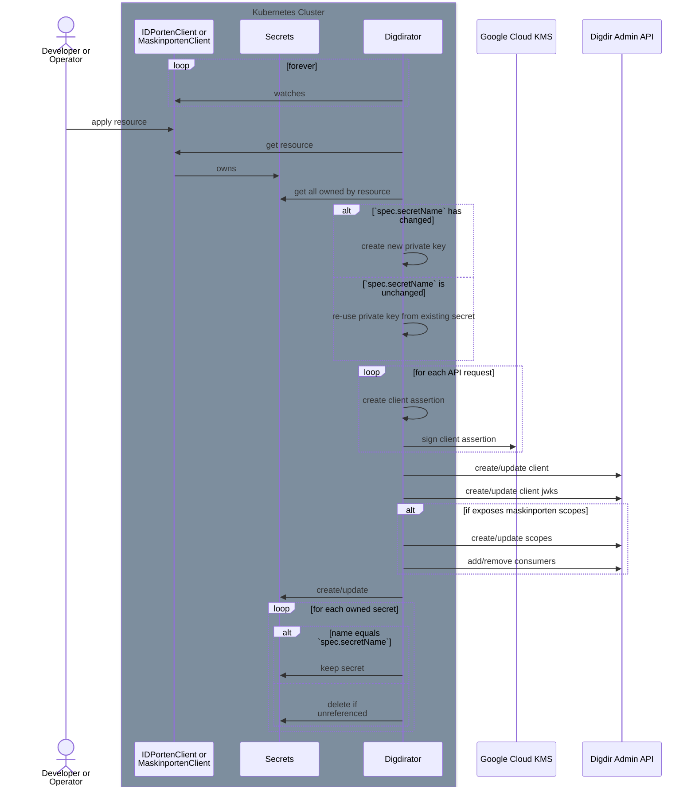

# digdirator

Digdirator is a Kubernetes operator for declarative registration and lifecycle management of
various resources within [Digdir](https://docs.digdir.no/) through
its [self-service API](https://docs.digdir.no/docs/idporten/oidc/oidc_api_admin).
It currently supports:

- [ID-porten clients / integrations](https://docs.digdir.no/docs/idporten/oidc/oidc_api_admin.html)
- [Maskinporten clients / integrations](https://docs.digdir.no/docs/Maskinporten/maskinporten_sjolvbetjening_api.html)
- [Maskinporten scopes / APIs](https://docs.digdir.no/docs/idporten/oidc/oidc_api_admin_maskinporten.html)

## CRDs

The operator uses two custom resource definitions (CRDs):

### `IDPortenClient`

```yaml
apiVersion: nais.io/v1
kind: IDPortenClient
metadata:
  name: my-app
  namespace: my-team
spec:
  clientURI: "https://domain.example"
  frontchannelLogoutURI: "https://domain.example/oauth2/logout/frontchannel"
  redirectURIs:
    - "https://domain.example/oauth2/callback"
  postLogoutRedirectURIs:
    - "https://domain.example/oauth2/logout/callback"
  secretName: my-secret
```

For the full CRD specification with all possible options, see
[nais/liberator/config/crd/nais.io_idportenclients.yaml](https://github.com/nais/liberator/blob/main/config/crd/bases/nais.io_idportenclients.yaml)

An `IDPortenClient` resource contains:

- the client configuration
- the name of the Kubernetes secret that the application expects to contain the client's credentials

The Kubernetes secret contains the following keys:

| Key                        | Description                                                                                     |
|----------------------------|-------------------------------------------------------------------------------------------------|
| `IDPORTEN_CLIENT_ID`       | The application's client ID.                                                                    |
| `IDPORTEN_CLIENT_JWK`      | The application's private JSON Web Key (JWK) for client authentication (RFC 7523, section 2.2). |
| `IDPORTEN_WELL_KNOWN_URL`  | The URL pointing to the ID-porten's well-known metadata document.                               |
| `IDPORTEN_ISSUER`          | The `issuer` property from the metadata document.                                               |
| `IDPORTEN_JWKS_URI`        | The `jwks_uri` property from the metadata document.                                             |
| `IDPORTEN_TOKEN_ENDPOINT`  | The `token_endpoint` property from the metadata document.                                       |

### `MaskinportenClient`

```yaml
---
apiVersion: nais.io/v1
kind: MaskinportenClient
metadata:
  name: my-app
  namespace: my-team
spec:
  secretName: my-secret
  scopes:
    exposes:
      # results in the fully qualified scope name:
      # `prefix:product:some/scope`
      - product: "product"
        name: "some/scope"
        enabled: true
        consumers:
          - orgno: "889640782"
    consumes:
      - name: "prefix:some/api.read"
```

For the full CRD specification with all possible options, see
[config/crd/nais.io_maskinportenclients.yaml](https://github.com/nais/liberator/blob/main/config/crd/bases/nais.io_maskinportenclients.yaml)

A `MaskinportenClient` resource contains:

- a list of scopes the application _consumes_ or needs access to (optional)
- a list of scopes the application _exposes_ (optional)
  - note: this will be extracted to its own CRD at some point
- the name of the Kubernetes secret that the application expects to contain the client's credentials

The Kubernetes secret contains the following keys:

| Key                           | Description                                                                                     |
|-------------------------------|-------------------------------------------------------------------------------------------------|
| `MASKINPORTEN_CLIENT_ID`      | The application's client ID.                                                                    |
| `MASKINPORTEN_CLIENT_JWK`     | The application's private JSON Web Key (JWK) for client authentication (RFC 7523, section 2.2). |
| `MASKINPORTEN_WELL_KNOWN_URL` | The URL pointing to Maskinporten's well-known metadata document.                                |
| `MASKINPORTEN_ISSUER`         | The `issuer` property from the metadata document.                                               |
| `MASKINPORTEN_JWKS_URI`       | The `jwks_uri` property from the metadata document.                                             |
| `MASKINPORTEN_TOKEN_ENDPOINT` | The `token_endpoint` property from the metadata document.                                       |

## Lifecycle



1. When an `IDPortenClient` or a `MaskinportenClient` resource is applied to the cluster (either by a developer or another operator), the Digdirator controller will reconcile it.
2. Digdirator reads the resource and retrieves all existing secrets owned by the resource.
3. Digdirator then checks if the `spec.secretName` has changed:
    1. If the secret name has changed, it creates a new private key for the application.
    2. If the secret name is unchanged, it reuses the private key from the existing secret.
4. For each request to Digdir's admin API, Digdirator creates a client assertion for authentication.
5. The application's configuration and public keys (JWKS) are registered/updated through the API.
    1. The JWKS contains all currently used public keys to ensure key rotation works properly.
    2. If the `MaskinportenClient` resource exposes Maskinporten scopes, these are also registered/updated. Consumers are added/removed as needed.
6. The operator creates or updates the Kubernetes secret with the specified `spec.secretName`.
7. Finally, any unreferenced secrets are deleted to clean up resources.
    1. Secrets are considered referenced if mounted as files or environment variables in a `Pod`.
       The `Pod` must have a label `app=<name>` where `<name>` is equal to `.metadata.name` in the `IDPortenClient` or `MaskinportenClient` resource.

## Usage

### Installation

```shell script
make install
```

### Digdir Setup

See the documentation over at Digdir for acquiring clients with the required scopes to access the self-service APIs:

- <https://docs.digdir.no/docs/idporten/oidc/oidc_api_admin_maskinporten#hvordan-f%C3%A5-tilgang->
- <https://docs.digdir.no/docs/idporten/oidc/oidc_api_admin#hvordan-f%C3%A5-tilgang->

Digdirator uses a single privileged client for administration of ID-porten and Maskinporten clients.
It authenticates itself with the DigDir self-service APIs by using a JWT grant signed with the configured business certificate.

### Google Cloud Platform Setup

Digdirator currently depends on a Google Cloud Platform product, namely Cloud Key Management Service (KMS).
The KMS is used to store the private key belonging to the business certificate.
These are needed for authenticating the DigDir client with Maskinporten using the JWT-bearer authorization grant.

You should set up [Workload Identity](https://cloud.google.com/kubernetes-engine/docs/how-to/workload-identity) for your GKE cluster.

Digdirator needs a Google IAM Service Account to access the GCP resources.
With Workload Identity, this should work automagically as we use Google's libraries that should automatically pick up the Kubernetes Service Account tokens and perform the necessary exchanges.

#### Cloud KMS

The Google Service Account needs the following IAM role for each _key_ in Cloud KMS:

- Cloud KMS CryptoKey Signer/Verifier (`roles/cloudkms.signerVerifier`)

Follow [Google's documentation for importing keys](https://cloud.google.com/kms/docs/importing-a-key).

The private key should be imported with the purpose set to `ASYMMETRIC_SIGN`, and the algorithm set to one of the `RSASSA-PKCS1 v1_5` variants.

### Configuration

Digdirator can be configured using command-line flags:

| Flag                                         | Type    | Default Value                                                | Description                                                                                                                         |
|:---------------------------------------------|:--------|:-------------------------------------------------------------|:------------------------------------------------------------------------------------------------------------------------------------|
| `--cluster-name`                             | string  |                                                              | The cluster in which this application should run.                                                                                   |
| `--digdir.admin.base-url`                    | string  |                                                              | Base URL endpoint for interacting with DigDir self service API.                                                                     |
| `--digdir.admin.cert-chain`                  | string  |                                                              | Full certificate chain in PEM format for business certificate used to sign JWT assertion.                                           |
| `--digdir.admin.client-id`                   | string  |                                                              | Client ID / issuer for JWT assertion when authenticating with DigDir self service API.                                              |
| `--digdir.admin.kms-key-path`                | string  |                                                              | Resource path to Google KMS key used to sign JWT assertion.                                                                         |
| `--digdir.admin.scopes`                      | string  | `idporten:dcr.write idporten:dcr.read idporten:scopes.write` | List of space-separated scopes for JWT assertion when authenticating with DigDir self service API.                                  |
| `--digdir.common.access-token-lifetime`      | int     | `3600`                                                       | Default lifetime (in seconds) for access tokens for all clients.                                                                    |
| `--digdir.common.client-name`                | string  | `ARBEIDS- OG VELFERDSETATEN`                                 | Default name for all provisioned clients. Appears in the login prompt for ID-porten.                                                |
| `--digdir.common.client-uri`                 | string  | `https://www.nav.no`                                         | Default client URI for all provisioned clients. Appears in the back-button for the login prompt for ID-porten.                      |
| `--digdir.common.session-lifetime`           | int     | `7200`                                                       | Default lifetime (in seconds) for sessions (authorization and refresh token lifetime) for all clients.                              |
| `--digdir.idporten.well-known-url`           | string  |                                                              | URL to [ID-porten well-known discovery metadata document](https://docs.digdir.no/docs/idporten/oidc/oidc_func_wellknown.html).      |
| `--digdir.maskinporten.default.client-scope` | string  | `nav:test/api`                                               | Default scope for provisioned Maskinporten clients, if none specified in spec.                                                      |
| `--digdir.maskinporten.default.scope-prefix` | string  | `nav`                                                        | Default scope prefix for provisioned Maskinporten scopes.                                                                           |
| `--digdir.maskinporten.well-known-url`       | string  |                                                              | URL to [Maskinporten well-known discovery metadata document](https://docs.digdir.no/docs/Maskinporten/maskinporten_func_wellknown). |
| `--features.maskinporten`                    | boolean | `false`                                                      | Feature toggle for maskinporten.                                                                                                    |
| `--leader-election.enabled`                  | boolean | `false`                                                      | Toggle for enabling leader election.                                                                                                |
| `--leader-election.namespace`                | string  |                                                              | Namespace for the leader election resource. Needed if not running in-cluster (e.g. locally).                                        |
| `--metrics-address`                          | string  | `:8080`                                                      | The address the metric endpoint binds to.                                                                                           |

At minimum, the following configuration must be provided:

- `cluster-name`
- `digdir.admin.base-url`
- `digdir.admin.cert-chain`
- `digdir.admin.client-id`
- `digdir.admin.kms-key-path`
- `digdir.admin.scopes`
- `digdir.idporten.well-known-url`
- `digdir.maskinporten.well-known-url`

The properties can also be set using environment variables using the following convention:

- convert to uppercase
- replace dashes (`-`) and dots (`.`) with underscores (`_`)
- prefix the property with `DIGDIRATOR_`

For example:

```text
digdir.admin.base-url -> DIGDIRATOR_DIGDIR_ADMIN_BASE_URL
```

Properties can also be specified using JSON, TOML or YAML config files.
Digdirator looks for a file named `digdirator.<ext>` in the directories [`.`, `/etc/`].

Example configuration in YAML:

```yaml
# ./digdirator.yaml

cluster-name: local
features:
  maskinporten: true
digdir:
  admin:
    base-url: "https://api.test.samarbeid.digdir.no"
    client-id: "some-client-id"
    cert-chain: |-
      -----BEGIN CERTIFICATE-----
      MII...
      -----END CERTIFICATE-----
    kms-key-path: "projects/<project-id>/locations/<location>/keyRings/<key-ring-name>/cryptoKeys/<key-name>/cryptoKeyVersions/<key-version>"
    scopes: "idporten:dcr.write idporten:dcr.read idporten:scopes.write"
  idporten:
    well-known-url: "https://test.idporten.no/idporten-oidc-provider/.well-known/openid-configuration"
  maskinporten:
    well-known-url: "https://test.maskinporten.no/.well-known/oauth-authorization-server"
```

## Development

If you're running locally, make sure you have access to the GCP resources and that you're authenticated with Application Default Credentials:

```shell script
gcloud auth login --update-adc
```

Then, assuming you have a Kubernetes cluster running locally (e.g.
using [minikube](https://github.com/kubernetes/minikube)):

```shell script
ulimit -n 4096  # for controller-gen
make run
make sample
```

## Verifying the Digdirator image and its contents

The image is signed "keylessly" (is that a word?) using [Sigstore cosign](https://github.com/sigstore/cosign).
To verify its authenticity run
```
cosign verify \
--certificate-identity "https://github.com/nais/digdirator/.github/workflows/build.yml@refs/heads/master" \
--certificate-oidc-issuer "https://token.actions.githubusercontent.com" \
ghcr.io/nais/digdirator@sha256:<shasum>
```

The images are also attested with SBOMs in the [CycloneDX](https://cyclonedx.org/) format.
You can verify these by running
```
cosign verify-attestation --type cyclonedx \
--certificate-identity "https://github.com/nais/digdirator/.github/workflows/build.yml@refs/heads/master" \
--certificate-oidc-issuer "https://token.actions.githubusercontent.com" \
ghcr.io/nais/digdirator@sha256:<shasum>
```