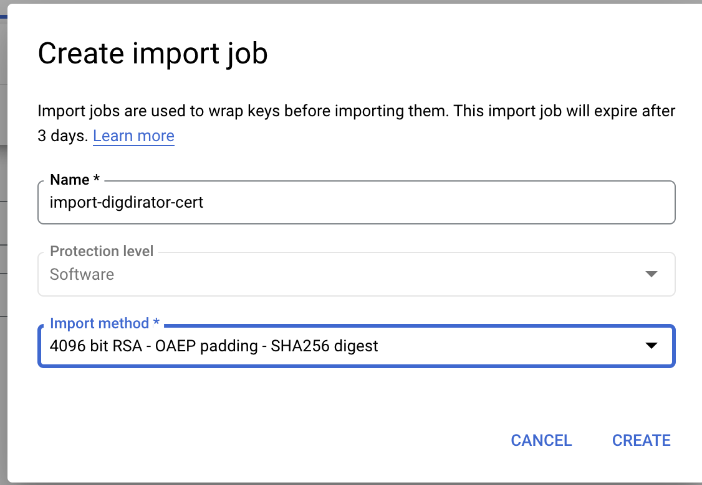
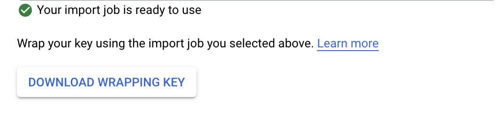
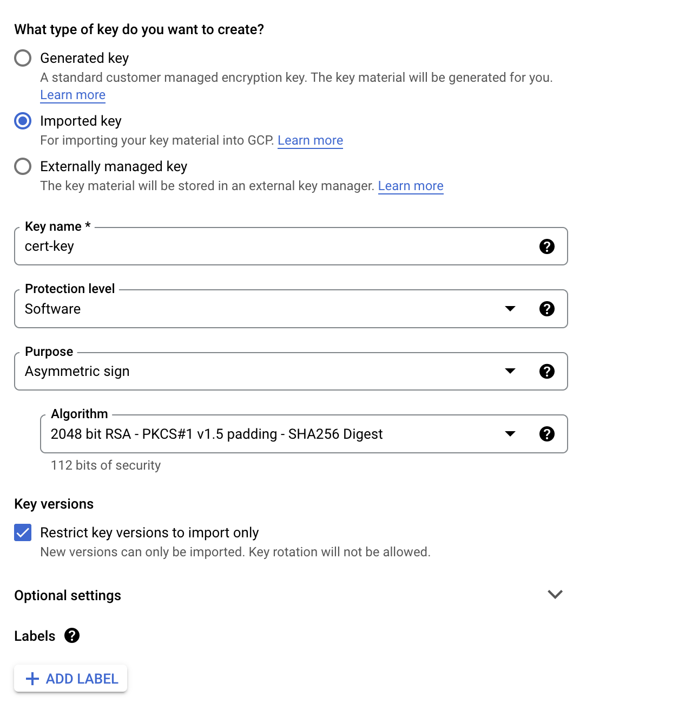

# Enable Digdirator

This describes how NAIS tenant applications can enable automated registration and lifecycle management of ID-porten
and Maskinporten clients.

[Digdirator](https://github.com/nais/digdirator) is a feature that integrates with Digdir self-service API.
In order for Digdirator to be able to use the self-service API, the tenant must receive an administration client
from Digdir, one for each client type (Maskinporten & ID-porten).
The Digdir self-service API is secured with oAuth2 using a `business certificate`.

The setup is divided into three parts:

* Clients are created by the responsible tenant in Digdir (if not already done)
    * `business certificate` is configured in Digdir
    * check that the [scopes](#digdir-configuration) are correct
* Upload `business certificate` to Google Key Management Service in your project
* Upload business certificate `certificate-chain` to Secret Manager in your project

## Pre-requisites

### Tenant

#### Digdir configuration

* Configure a administration client for ID-porten
* Configure a administration client for Maskinporten
* Responsible tenant have a `business certificate` registered
* The ID-porten administration client is configured with scopes: `idporten:dcr.write idporten:dcr.read`
* The Maskinporten administration is configured with
  scopes: `idporten:dcr.write idporten:dcr.read idporten:scopes.write`

For each administration client the tenant have to provide the following information:

* The Client ID

The Client ID is used by Digdirator and set as `jwt.claim.iss` when authenticate against Digdir self-service API.

#### NAIS configuration

We care about your compadres (tenants) and we think that a separation of concerns is a good & secure way to go.
It also helps us to keep the cluster secure and stable, the configuration setup for Digdirator always favor security and
NAIS will not have direct access to your business certificate.

In order for NAIS to enable Digdirator for a tenant following steps must be taken:

##### Business certificate

The tenant [upload](#upload-business-certificate) their `business certificate` to
[Google Cloud KMS](https://cloud.google.com/kms/docs/how-tos). Digdirator never have direct access to the certificate,
the `business certificate` are only used as a "signing-key".
The uploaded `business certificate` can never be downloaded or retrieved from the KMS storage (not even from you).
An authenticated & authorized Digdirator only requests the KMS so sign a payload containing an unsigned token-header
with claims. The KMS then returns a signed JWT, this JWT is later used to authenticate against Digdir self-service API.

[Uploading a business certificate to Google Cloud KMS](#upload-business-certificate)

When the certificate is uploaded to the actual KMS, the tenant can provide NAIS the following information:
A KMS resource name with the format:

`projects/<project-id>/locations/<location>/keyRings/<key-ring>/cryptoKeys/<key-name>/cryptoKeyVersions/<version>`

Resource name can be copied to the clipboard in the dot menu and `Copy resource name`.

> Update a certificate only requires the tenant to provide the new version

##### Certificate chain

Now your probably are wondering why another secret storage we already configured KMS?
Well, the certificate chain is required to be added to the JWT header when requesting changes in the
Digdir self-service API. The certificate chain is added to the `x5c` header where the IDP (Identity Provider)
in this case Digdir, can identify the signer.

`Cloud KMS` is designed as a cryptographic system: nobody, including yourself, can get the keys out: this means they're
locked inside the system, and you don't have to worry in practice about them leaking. The tradeoff is that the only
thing you can do with those keys is encrypting, decrypt, and other cryptographic operations.

But when you do have configuration info like a certificate chain or a password, where your software actually needs the
secret, not cryptographic operations, then `Secret Manager` is designed for that use case.

When the certificate chain is uploaded to the `Secret Manager`, the tenant can provide NAIS the following information:

* Secret name
* version
* project-id

> This information unlikely to change, only if a new certificate type is added to the Google KMS.

Uploaded format:

```Text
-----BEGIN CERTIFICATE-----
MIIFCDECEBC...
-----END CERTIFICATE-----
-----BEGIN CERTIFICATE-----
MIIE3sKEA...
-----END CERTIFICATE-----
-----BEGIN CERTIFICATE-----
MIIFZTKKL---
-----END CERTIFICATE-----
```

### NAIS

NAIS sets up Digdirator with a service account with roles to be able to access
[Google Cloud KMS](https://cloud.google.com/kms/docs/how-tos). The service account is created by default when a NAIS
tenant cluster is up and running with Digdirator enabled. The service account assigned Digdirator is given the
role `roles/cloudkms.signerVerifier`, which enables Sign, Verify, and GetPublicKey operations, more specific:

```Text
cloudkms.cryptoKeyVersions.useToSign
cloudkms.cryptoKeyVersions.useToVerify
cloudkms.cryptoKeyVersions.viewPublicKey
cloudkms.locations.get
cloudkms.locations.list
resourcemanager.projects.get
```

For Secret Manager the service account is given the role `roles/secretmanager.secretAccessor` which allows Digdirator to
access the payload of secrets:

```Text
resourcemanager.projects.get
resourcemanager.projects.list
secretmanager.versions.access
```

NAIS configure Digdirator with the information provided by the tenant, and NAIS deploys Digdirator to the tenant cluster
and observe that it works as expected.

### Summary

If we were to express the above in yaml, it would look like this:

```yaml
Maskinporten:
  digdir:
    client-id: "123456789"
  kms:
    key: "projects/123456789/locations/europe-north1/keyRings/nais-test/cryptoKeys/digdirator/cryptoKeyVersions/1"
  secret-manager:
    name: "digdirator"
    project-id: "123456789"
    version: "1"
ID-porten:
  digdir:
    client-id: "123456789"
  kms:
    key: "projects/123456789/locations/europe-north1/keyRings/nais-test/cryptoKeys/digdirator/cryptoKeyVersions/1"
  secret-manager:
    name: "digdirator"
    project-id: "123456789"
    version: "1"
```

# TODO

## Upload business certificate

If you haven't already [enable](https://cloud.google.com/security-key-management) KMS resource in your project.

### Create Key ring

In the console choose project for KMS, and create new keyring and name it, be sure to set region `europe-north1` (
Finland).

Steps are described in [Google KMS documentation](https://cloud.google.com/kms/docs/importing-a-key#create_targets).

#### gcloud CLI

KEY_RING = "my-key-ring"
LOCATION = "europe-north1"

```
gcloud kms keyrings create KEY_RING \
  --location LOCATION
```

#### Create Job

You will be asked to create a [import job](https://cloud.google.com/kms/docs/importing-a-key#create_importjob)



Download the wrapping key



[setup variables](https://cloud.google.com/kms/docs/wrapping-a-key#set_up_environment_variables) and wrap the key
with [RSA](https://cloud.google.com/kms/docs/wrapping-a-key#rsa_wrap)

NB! No need to set `TEMP_AES_KEY`

```
gcloud kms import-jobs create IMPORT_JOB \
  --location LOCATION \
  --keyring KEY_RING \
  --import-method IMPORT_METHOD \
  --protection-level PROTECTION_LEVEL
```

#### Create Key



### Import certificate

* Algorithm: 2048-bit RSA key PKCS#1 v1.5 padding - SHA256 Digest
* [Step-by-step](https://cloud.google.com/kms/docs/importing-a-key)

### Digdirator service account

[Give access](https://cloud.google.com/storage/docs/encryption/using-customer-managed-keys#service-agent-access)
to the service account to the created key to enable Digdirator to sign and verify payloads with certificates stored in
KMS.